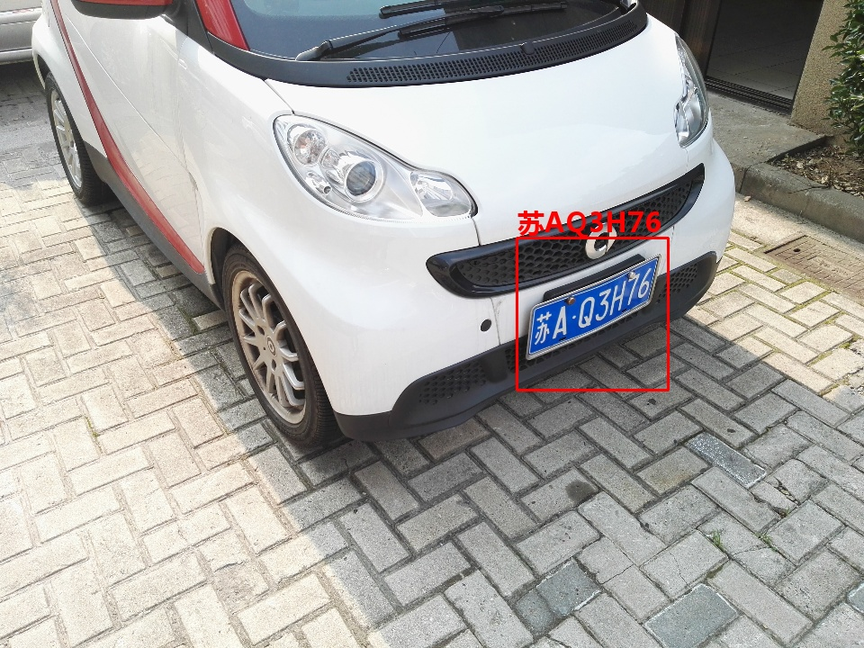

## lpr 一个实际场景下的中文车牌识别软件
该软件基于开源软件项目https://github.com/zeusees/HyperLPR 以及 https://github.com/zeusees/Mobilenet-SSD-License-Plate-Detection 开发。

支持国内蓝、黄、绿、警单行车牌的识别，车牌定位支持haar级联定位和ssd定位，车牌识别支持端到端字符识别。

识别准确率95%，性能：普通笔记本电脑，3fps（cpu）,10fps（intel gpu）。

## 使用

直接克隆或下载项目。

项目使用pycharm，python3.7 64位版， window10 64位版开发，开发环境配置：

1. 安装anaconda3

2. pip install tensorflow
   
3. pip install keras
   
4. pip install opencv-python
   
5. 项目解压后，可以在cmd窗口，切换路径到项目路径下，执行： `python lprcmd.py` 或者 `python  lpr.py --video=test.mp4`
   
## 主要项目文件说明

lprcmd.py:haar车牌定位加端到端车牌字符识别，命令行工具，输入是指定目录下（默认是test-imgs）的车牌图片，输出为指定目录下（默认是test-results）的识别结果文件。

lprssd.py:ssd车牌定位加端到端车牌字符识别，命令行工具，输入是指定目录下的车牌图片，输出为指定目录下的识别结果文件。

lpr.py:识别视频流中车牌的命令行代码，输入是图片或视频流，默认输出是项目路径下的识别图片或视频。

lprmix.py:混合了ssd和haar车牌定位的算法，在cpu下可以取得更好的识别准确率和性能。
   
HyperLprGUI.py: 展示车牌图片识别的图形界面程序。

## 示例图片
 

## TODO
1. 优化视频流车牌定位功能，提高定位速度及准确率
2. 实现车牌定位web服务功能

## 贡献者
xuyu44f 测试、文档（ https://github.com/xuyu44f ）

